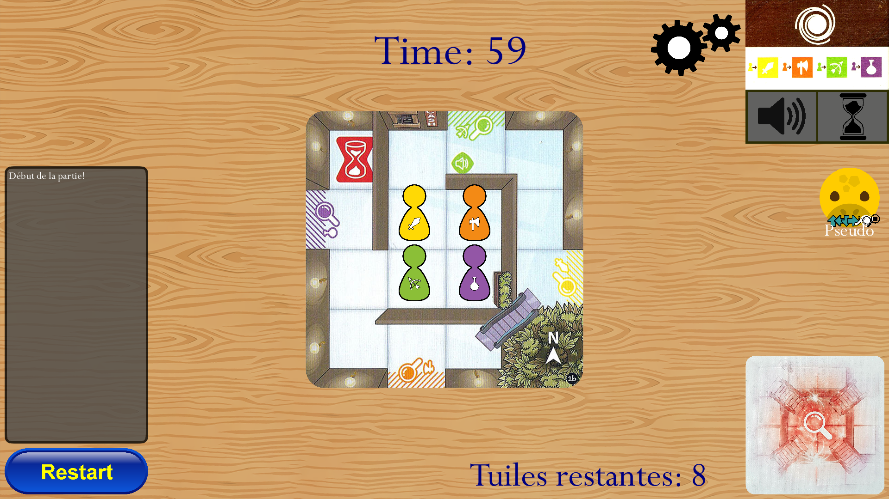

# Projet de Développement Informatique (Télécom SudParis, 2021) : Magic Maze
Cette adaptation du jeu de plateau Magic Maze a été réalisée dans le cadre du module PRO3600 :
Génie Logiciel et Gestion de Projets Informatiques de Télécom SudParis,
en utilisant le framework LibGDX et les languages Java 8 et Kotlin.
## Présentation du jeu
Le but du jeu est tout de faire en sorte que chaque pion récupère son arme, en le posant sur la carte correspondante, 
puis de s'échapper, en menant les pions à la sortie. La première phase, où il faut récupérer les armes, 
est nommée "Phase A"; la deuxième, "Phase B". Le labyrinthe (un centre commercial en vérité) est construit petit à petit
à partir d'une pile de carte, dont la première se révèle en posant un pion sur une sortie de la bonne couleur.
Les phases sont différentiées par un changement de musique et par une indication visuelle en haut à droite.

Il existe plusieurs cases spéciales ayant des effets divers et variés. Ainsi, les cases portails permettent, pendant la
phase A, de voyager instantanément un pion d'une couleur vers un portail de la même couleur.
Les escalateurs permettent de passer au dessus des murs, les raccourcis permettent de passer à travers.

L'intérêt du jeu est que la collaboration entre les joueurs est obligatoire et silencieuse. En effet, les joueurs ne
peuvent discuter entre eux que lorsque l'icône en haut à droite l'indique, et chaque joueur ne peut réaliser qu'un
certain set d'actions, indiqué sous son pseudo à droite. Il y a ainsi un rôle pour s'occuper des portails, des 
racourcis, des escalateurs, et des cartes. Il y a également un rôle pour déplacer vers le haut, le bas, la droite et la gauche.
## Comment jouer
Le jeu ouvre sur un menu, où l'on peut sélectionner son pseudo (si possible, différent de celui des autres joueurs).
Le champ en dessous du pseudo indique notre adresse IP locale, qu'il faut communiquer aux autres joueurs si l'on désire
héberger la partie. Le menu "Options" permet de régler le volume sonore, et à sa droite se trouve un bouton pour lire
les règles du jeu. Le bouton "Créer une partie" permet d'héberger une partie, et "Rejoindre une partie" permet d'en
rejoindre une, hébergée à l'adresse IP renseigné dans le champ susnommé.

Une fois une partie rejointe, vous serez mis dans un lobby, en attendant tous les autres joueurs. Vous pouvez alors
choisir votre avatar. Une fois que tout le monde est là, appuyez sur "Lancer a partie" pour lancer la partie.

L'interface de jeu est relativement simple: au centre se trouve le plateau de jeu, à droite la liste des joueurs,
en bas à droite la pile de carte, en haut à droite les indications de la partie.
Enfin, en bas à gauche se situe les logs, listant les actions récentes de la partie,
et le bouton "Restart", qui permet d'indiquer aux autres joueurs notre désire de redémarrer la partie.

## Considérations Techniques
Les joueurs doivent être sur un réseau local, ou bien le joueur hébergeant la partie doit avoir ouvert son port (6969 par défaut, possibilité
de modifier cela dans le code source au niveau du fichier `src.com.utils.Multiplayer`).

Si vous voulez lancer depuis le .jar ou build par vous même, notre version de Java est la 8, en nous avons utilisé le 
JDK de OpenJDK, comme cela l'était recommandé par les développeurs de LibGDX (même si cela ne devrais pas avoir d'impact).

Si vous voulez build par vous même, utilisez la commande `gradlew desktop:dist`.
Le jar produit sera situé dans `desktop/build/libs`